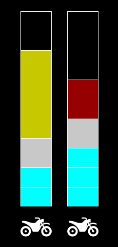

# IA

System to manage distribution of goods during a natural disaster, with search algorithms for maps
and a genetic algorithm for bin-packing. UMinho's Artificial Intelligence 2024/25 assignment. See
[Assignment.pdf](Assignment.pdf) for more details.




Grade: 18 / 20 🫠

### Authors

 - Ana Cerqueira (A104188)
 - Humberto Gomes (A104348)
 - João Torres (A95748)
 - José Lopes (A104541)
 - José Matos (A100612)

# Setup

Start by cloning this repository, and creating a Python virtual environment:

```
$ git clone https://github.com/voidbert/IA.git
$ python -m venv .venv
```

To run the project, do:

```
$ source .venv/bin/activate
$ pip install .
$ python -m IA
```

To exit the virtual environment, you can run:

```
$ deactivate
```

# Developers

All code must be verified with the `pylint` and `mypy` static checkers, which can be installed
(inside the `venv`) with the following command:

```
$ pip install pylint mypy
```

Before opening a Pull Request, please run your code though `pylint` and `mypy`, fixing any error
that may appear:

```
$ pylint IA
$ mypy IA
```

Our configuration for these checkers disallows the use of dynamic typing, and your PR won't be
accepted if these checks are failing.
